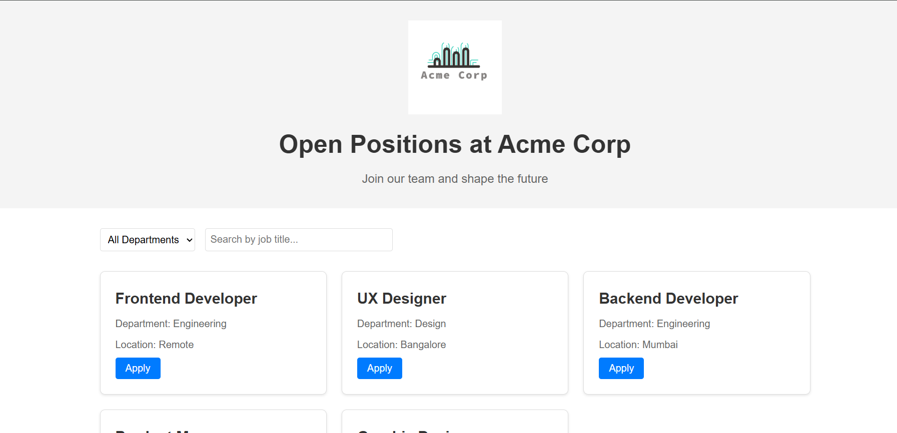

# 🧳 Mini Job Board — Acme Corp

A responsive and modern Job Board website for Acme Corp.  
Users can browse available job listings, search by title, filter by department, and view job descriptions in a modal popup.

---

### ✨ Features

- Job listings with title, department & location  
- Search by job title  
- Filter by department  
- Modal popup with full job details  
- Theme toggle (Light/Dark)  
- Loader animation during data fetch  
- Fully responsive for mobile, tablet, and desktop  

---

### 📸 Screenshot


=======


---

### 📂 Folder Structure

Mini-Board/
│
├── index.html
├── README.md
├── screenshot.png
├── css/
│ └── styles.css
├── js/
│ └── main.js
└── data/
└── jobs.json


### 🚀 How to Run This Project

1. Clone this repository:

```bash
git clone https://github.com/AnshulExplorer/Acme-Corp.git

2. Open the project folder:

bash
cd Acme-Corp

3. Open index.html directly in your browser
or use Live Server extension in VS Code.

🙋‍♂️ Author
Anshul Dhiman
🔗 GitHub: @AnshulExplorer

```bash
git add README.md
git commit -m "Final README with all sections"
git push
